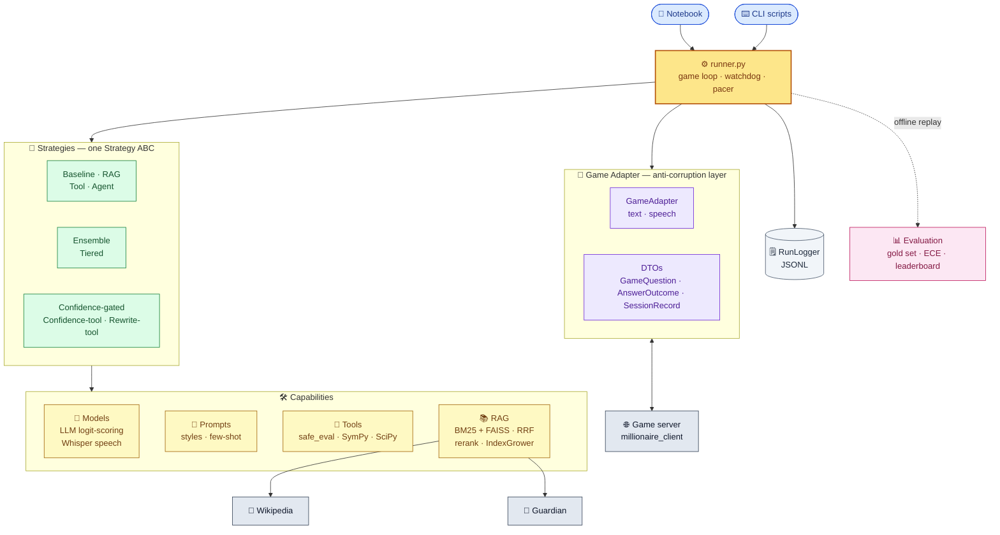

# PoliMillionaire

[](https://www.python.org/downloads/)
[](#license)
[]()

A chatbot system for *Who Wants to Be a PoliMillionaire?* — the multiple-choice quiz game used in the Politecnico di Milano NLP 2025/26 group assignment. The bot reads four-option questions (as **text or speech**), selects answers with a range of AI strategies (LLM inference, RAG retrieval, tool use, confidence gating, ensembles), and submits them to the assignment server while climbing a 15-level prize ladder (top prize **€1,024,000**) across **six** competition categories: **Entertainment**, **Ancient History & Politics**, **Science & Nature**, **Maths**, **Philosophy & Psychology**, and **News**.

The implementation is a modular Python package (`polimibot`) with a Jupyter notebook ([`PoliMillionaire.ipynb`](PoliMillionaire.ipynb)) as an experimentation workbench. Every strategy implements the same single-method interface, so models, RAG, tools, and routing can be swapped with minimal configuration changes.

> 📚 **Full technical docs (live site):** an illustrated guide is published at **[m-ebrahimzadeh.github.io/PoliMillionaire](https://m-ebrahimzadeh.github.io/PoliMillionaire/)** — browse the [per-layer deep dives](https://m-ebrahimzadeh.github.io/PoliMillionaire/layers_doc/) or the [single-page complete guide](https://m-ebrahimzadeh.github.io/PoliMillionaire/polimillionaire_complete.html).

---

## Highlights

Measured on the offline **gold set** (see [Results](#results) for the full picture and caveats):

| | |
|---|---|
| 🎯 **96.8%** best accuracy | confidence-gated strategy, n = 895 |
| 🎚️ **ECE 0.013** | near-perfect calibration |
| ⚡ **1.4 s** p50 latency | (p95 1.8 s) — single forward pass |
| 🏆 **Level 15 / €1,024,000** | reached in live play |
| 📚 **83,371 chunks** | hybrid Wikipedia + Guardian-news index |

---

## Table of Contents

- [Features](#features)
- [Architecture](#architecture)
- [Strategy Hierarchy](#strategy-hierarchy)
- [RAG Pipeline](#rag-pipeline)
- [Tech Stack](#tech-stack)
- [Prerequisites](#prerequisites)
- [Installation](#installation)
- [Configuration](#configuration)
- [Usage](#usage)
- [Evaluation](#evaluation)
- [Results](#results)
- [Project Structure](#project-structure)
- [Running Tests](#running-tests)
- [Documentation](#documentation)
- [Contributing](#contributing)
- [Acknowledgements](#acknowledgements)
- [License](#license)
- [Notes for Evaluators](#notes-for-evaluators)

---

## Features

- **Six category-aware competitions** — Entertainment, Ancient History & Politics, Science & Nature, Maths, Philosophy & Psychology, and News, each with a tailored system prompt and routing.
- **Ten answering strategies** — seven core strategies (random baseline → ReAct agent) plus three deployment-composition strategies (confidence gating, confidence + tools, LLM-rewrite + tools).
- **Hybrid RAG pipeline** — asymmetric BGE embeddings, BM25 with proximity bonus and alias terms, reciprocal rank fusion, and cross-encoder reranking over an **83k-chunk** index.
- **Self-growing index** — `IndexGrower` learns confirmed-correct live-fetched articles into the offline index across sessions.
- **News → Guardian hybrid retrieval** — dated News questions are answered from The Guardian Open Platform (offline harvest **and** an online, date-aware live fallback), with graceful Wikipedia degradation when no key is set.
- **Deterministic tool suite** — `safe_eval` (AST-sandboxed calculator), `MathsTool`, `SympyDirectTool` (23 pre-LLM patterns), `sympy_solve` (sandboxed SymPy for the agent loop), and `StatsTool` (SciPy distributions).
- **Speech mode** — questions delivered as audio are transcribed with OpenAI Whisper and exposed to strategies as ordinary text.
- **Comprehensive evaluation** — accuracy, Expected Calibration Error (ECE), latency p50/p95, per-category breakdowns, retrieval Recall@k/MRR, threshold calibration, and a consolidated leaderboard.
- **Experimentation workbench** — a Jupyter notebook with configuration knobs, comparison leaderboards, and calibration plots.
- **Crash-safe logging** — append-only JSONL with per-question records and game summaries.

---

## Architecture

PoliMillionaire follows a modular, layered architecture designed for experimentation and strategy swapping. The detailed walkthroughs live in the [complete guide](https://m-ebrahimzadeh.github.io/PoliMillionaire/polimillionaire_complete.html) and the [game-architecture guide](https://m-ebrahimzadeh.github.io/PoliMillionaire/layers_doc/game_explained.html).



### Component responsibilities

| Layer | Component | Responsibility |
|-------|-----------|----------------|
| **Entry** | Notebook, CLI scripts | Experiment configuration, batch/headless play |
| **Core** | `runner.py` | Game loop, watchdog (time budget), pacer (rate limit), outcome logging |
| **Adapter** | `GameAdapter` | Wraps `millionaire_client`; converts to frozen DTOs; hides text/speech mode |
| **Strategies** | 7 core + 3 composition | Answer selection; all implement the `Strategy` ABC |
| **Models** | `LLM`, `MockLLM`, `SpeechTranscriber` | Logit scoring over A/B/C/D; Whisper transcription |
| **Prompts** | `PromptStyle`, few-shot bank | Category prompts, few-shot injection, answer parsing |
| **RAG** | Retriever pipeline | Corpus harvest, chunk/embed, BM25 + FAISS, fusion, rerank, live fallback, index growth |
| **Tools** | calculator / SymPy / SciPy | Deterministic math, symbolic, and statistical solvers |
| **Eval** | `evaluate_strategy`, `EvalReport`, leaderboard | Accuracy/ECE/latency, per-category, retrieval, calibration |
| **Logging** | `RunLogger` | Append-only JSONL with manifest, questions, summaries |
| **Client** | `millionaire_client` | HTTP communication with the game server (provided, read-only) |

### Data flow

1. `GameAdapter` receives a question (text or transcribed audio) → `GameQuestion` DTO.
2. `runner.py` calls `strategy.answer(input)` with question, options, category, level.
3. The strategy executes its logic (LLM scoring, retrieval, tool use, gating, fusion).
4. It returns a `StrategyOutput` (chosen letter + confidence + extras).
5. `runner.py` submits via `GameAdapter` and receives an `AnswerOutcome`.
6. `RunLogger` records the question, output, correctness, latency, and prize progression.
7. Post-game, `build_gold_set.py` mines confirmed-correct answers for offline eval.
8. `eval_*.py` replay the gold set, computing accuracy/ECE/latency and a leaderboard.

The model is **configurable** — `LLMSpec(model_id=...)` accepts any HF causal LM; the evaluated backbones include **Phi-4**, **Qwen3-8B**, Qwen2.5-7B/14B, Llama-3.1/3.2, Mistral-7B, and others.

---

## Strategy Hierarchy

All strategies implement the `Strategy` ABC with a single `answer(StrategyInput) -> StrategyOutput` method. Deep dive: [strategy architecture guide](https://m-ebrahimzadeh.github.io/PoliMillionaire/layers_doc/strategies_explained.html).

### Core strategies (exported from `polimibot.strategies`)

| Strategy | Description | Best for |
|----------|-------------|----------|
| `RandomStrategy` | Uniform random selection | Baseline floor (~25%) |
| `BaselineLLMStrategy` | Single LLM call, logit-scored over A/B/C/D | General questions, easy tier |
| `RAGStrategy` | Retrieve top-k passages, then logit-score | Factual recall, medium tier |
| `ToolStrategy` | Chain-of-responsibility over tools, LLM fallback | Mathematical computation |
| `AgentStrategy` | ReAct loop: LLM emits tool calls, executes, iterates (`max_iterations=2`) | Multi-step reasoning |
| `EnsembleStrategy` | Weighted probability fusion across strategies | Hard-tier questions |
| `TieredStrategy` | Routes by level + category, with a Maths override | Production composition |

### Deployment-composition strategies

These compose the basics for deployment and share the same `answer()` contract (available as modules in `polimibot/strategies/`):

- **`ConfidenceGatedStrategy`** — runs a fast primary; escalates to a heavier `fallback` (e.g. live-RAG) only when the primary's logit **margin** (top1 − top2) is below `margin_threshold` (default 0.20). `always_fallback_categories` (e.g. News) force escalation. Keeps API volume under rate limits without moving the accuracy ceiling.
- **`ConfidenceToolStrategy`** — pins a fast LLM answer, then tries deterministic tools only when confidence is low; the pinned answer always ships (zero timeout risk).
- **`RewriteToolStrategy`** — five-stage Maths pipeline: direct tools → pinned LLM → confidence gate → LLM rewrites the question into one SymPy expression solved directly → pinned fallback.

```python
# TieredStrategy composes multiple strategies; gating wraps them for deployment
tiered = TieredStrategy(
    easy_strategy=BaselineLLMStrategy(llm),         # levels 1-5
    medium_strategy=RAGStrategy(llm, retriever),    # levels 6-10
    hard_strategy=EnsembleStrategy([                # levels 11-15
        RAGStrategy(llm, retriever, weight=0.4),
        ToolStrategy(llm, [MathsTool()], weight=0.3),
        AgentStrategy(llm, [MathsTool()], weight=0.3),
    ]),
    category_overrides={Category.MATHS: ToolStrategy(llm, [MathsTool(), SympyDirectTool()])},
)
```

---

## RAG Pipeline

Full walkthrough: [RAG pipeline guide](https://m-ebrahimzadeh.github.io/PoliMillionaire/layers_doc/rag_explained.html).

The retriever is a **hybrid Wikipedia + Guardian-news** index, not a Wikipedia-only one:

- **Corpus harvest** — entity + concept Wikipedia categories (`category_seeds.py`) plus an explicit safety-net list, fetched and cleaned into `corpus.jsonl`; News is harvested from The Guardian.
- **Chunk → embed → index** — sentence/section-aware chunking (`chunk_size=300`, `overlap=50`), grounded passage embeddings (`embedding_text()`), stored in FAISS (`IndexFlatIP`) and a positional BM25 index.
- **Search** — dense (FAISS) + sparse (BM25, with a phrase-proximity bonus and alias terms), merged by **Reciprocal Rank Fusion**, with multi-query expansion and a cross-encoder reranker.
- **Score-gated live fallback** — when offline scores are too low, fetch fresh articles live (Wikipedia for most categories; the date-aware Guardian source for News), then learn confirmed-correct ones back into the index via `IndexGrower`.

**Index scale (measured from the shipped index):** **83,371 chunks** from **~10,800 source documents** — roughly **4,950 Wikipedia articles** (the five knowledge categories) plus **~5,850 Guardian news articles**. News is the single largest slice (**≈38%** of chunks; ~31.8k), followed by science (15.4k), philosophy (12.3k), entertainment (11.9k), history (9.3k), and maths (2.6k). Embedder: **BAAI/bge-base-en-v1.5** (768-d, asymmetric); reranker: **BAAI/bge-reranker** cross-encoder (`bge-reranker-base` by default; `bge-reranker-v2-m3` in the reported runs).

---

## Tech Stack

| Component | Technology |
|-----------|------------|
| **Language** | Python 3.11+ |
| **Core** | `requests>=2.31` |
| **LLM inference** | `torch>=2.1`, `transformers>=4.44`, `accelerate>=0.33`, `bitsandbytes>=0.43` (4-bit NF4) |
| **RAG** | `faiss-cpu>=1.7`, `sentence-transformers>=2.7`, `wikipedia>=1.4`, `numpy>=1.26` |
| **Tools** | `sympy>=1.13` (symbolic), `scipy>=1.11` (statistics) |
| **Speech** | `openai-whisper>=20231117`, `scipy` (WAV decoding) |
| **Notebook / analysis** | `pandas>=2.0`, `matplotlib>=3.8`, `openpyxl>=3.1` |
| **Testing** | `pytest>=8` |
| **Embedding model** | BAAI/bge-base-en-v1.5 (configurable) |
| **News source** | The Guardian Open Platform (free key) |
| **Game client** | Provided HTTP client for the PoliMillionaire server |

---

## Prerequisites

- **Python 3.11 or newer**
- **pip** and **Git**
- **PoliMillionaire server credentials** (`POLIMI_USER` / `POLIMI_PASS` from the course)
- **GPU (optional)** — recommended for LLM inference; CPU-only mode works with `MockLLM`
- **Guardian API key (optional)** — free from [open-platform.theguardian.com](https://open-platform.theguardian.com); absent → News degrades to Wikipedia
- **Whisper (optional)** — only needed for speech-mode play

For Colab users, the notebook handles Google Drive mounting and repository cloning automatically.

---

## Installation

Clone and install in editable mode:

```bash
git clone https://github.com/m-ebrahimzadeh/PoliMillionaire.git
cd PoliMillionaire
pip install -e .
```

For the full environment (LLM + RAG + tools + speech + notebook + dev):

```bash
pip install -e ".[all]"
```

Or install only the extras you need:

| Extra | Purpose | Key packages |
|-------|---------|--------------|
| `llm` | Transformer inference with 4-bit quantization | `torch`, `transformers`, `accelerate`, `bitsandbytes` |
| `rag` | Retrieval-augmented generation | `faiss-cpu`, `sentence-transformers`, `wikipedia`, `numpy` |
| `tools` | Symbolic math (upgrades `MathsTool`; `safe_eval` works without it) | `sympy` |
| `speech` | Audio-question transcription | `openai-whisper`, `scipy` |
| `notebook` | Notebook & analysis plots/exports | `pandas`, `matplotlib`, `openpyxl` |
| `dev` | Tests | `pytest` |
| `all` | Everything above | — |

---

## Configuration

### Environment variables

| Variable | Purpose | Default |
|----------|---------|---------|
| `POLIMI_USER` | Game server username | *required for live play* |
| `POLIMI_PASS` | Game server password | *required for live play* |
| `POLIMI_API_URL` | Override game server URL | `http://131.175.15.22:51111` |
| `POLIMIBOT_ROOT` | Override project-root detection | auto-detected via `pyproject.toml` |
| `GUARDIAN_API_KEY` | The Guardian key for the News category | *optional* — absent → Wikipedia fallback |

### Runtime configuration

Runtime knobs live in `polimibot.config.RuntimeConfig` (exposed as the `RUNTIME` singleton). Fields: `hard_cutoff_seconds` (25.0 — the strategy must return by this), `soft_cutoff_seconds` (18.0), `api_min_delay_seconds` (1.5), `game_mode` (`"text"` or `"speech"`), and `api_url`. Override with the helper (it rebinds the global, so the notebook can retune without restarting the kernel):

```python
from polimibot.config import update_runtime
update_runtime(hard_cutoff_seconds=30.0, api_min_delay_seconds=2.0)
```

The News source is configured by `NewsConfig` (the `NEWS` singleton), with a matching `update_news(...)` helper — knobs include `date_window_days` (±2), `max_articles` (3), `use_full_body`, and disk-cache TTLs.

### Speech mode

Set `game_mode="speech"` and construct the adapter with a `SpeechTranscriber` (`polimibot/models/speech.py`, a thin Whisper wrapper). The adapter fetches and transcribes the question and all four option clips, then exposes the same `GameQuestion` DTO — strategies see only text. See the [game-architecture guide](https://m-ebrahimzadeh.github.io/PoliMillionaire/layers_doc/game_explained.html).

### RAG index building

Before using RAG strategies, build the index (one-time; slow on first run):

```bash
python scripts/build_rag_index.py
```

This harvests Wikipedia articles, chunks them, computes embeddings, and writes the FAISS + BM25 index under `data/cache/`.

### News — hybrid online/offline RAG

News questions reference a *specific dated article* ("the article published on `2026-05-17`…"), which Wikipedia cannot serve. The News category therefore uses **The Guardian Open Platform** (free key, full body text, precise date filtering):

```bash
export GUARDIAN_API_KEY=...                       # free key
python scripts/build_rag_index.py --fresh         # base index (all categories), first time
python scripts/fetch_news_corpus.py --days 30 --build
```

The harvest pulls the window **day by day** so every date is covered evenly. At question time, News uses the same threshold-gated live fallback as every other category, but its source is the date- and entity-aware [`NewsLiveSearch`](polimibot/rag/news_search.py); it falls back to Wikipedia when the Guardian returns nothing or no key is set. Guardian responses are cached under `data/cache/news/` (keyed without the API key), so eval replays cost no quota.

---

## Usage

### Quickstart — the notebook

The primary entry point is [`PoliMillionaire.ipynb`](PoliMillionaire.ipynb), an experimentation workbench:

1. **Section 0 — Setup**: install, imports, login, index build
2. **Section 1 — Configure**: model, prompt style, RAG/tools toggles, gating, tier breakpoints, speech mode
3. **Section 2 — Run**: evaluate strategies offline against the gold set, plot per-category accuracy
4. **Section 3 — Compare**: load reports into a leaderboard DataFrame with bar plots and heatmaps
5. **Section 4 — Save**: inventory and final summary

Switching strategies requires changes only in Section 1. Prompt design lives in the [prompt-engineering guide](https://m-ebrahimzadeh.github.io/PoliMillionaire/layers_doc/prompts_explained.html).

### Quickstart — CLI

```bash
# Smoke test with RandomStrategy
POLIMI_USER=... POLIMI_PASS=... python scripts/smoke_game.py

# Play one game per competition with a baseline LLM
POLIMI_USER=... POLIMI_PASS=... python scripts/play_baseline.py

# Build the gold/wrong sets from run logs
python scripts/build_gold_set.py
python scripts/build_wrong_set.py

# Build the RAG index (one-time) and harvest News
python scripts/build_rag_index.py
python scripts/fetch_news_corpus.py --days 30 --build
python scripts/mine_corpus_gaps.py        # mine missing-article candidates from run logs

# Evaluate strategies offline
python scripts/eval_rag.py
python scripts/eval_rag_delta.py          # baseline-vs-RAG delta on the same questions
python scripts/eval_tools.py
python scripts/eval_agent.py
python scripts/eval_ensemble.py
python scripts/eval_tiered.py

# Calibrate gating thresholds and tier breakpoints
python scripts/calibrate_min_score.py
python scripts/sweep_tiers.py --easy 3 5 7 --medium 8 10 12

# Plot a calibration (reliability) curve from a run log
python scripts/plot_calibration.py data/runs/run_<timestamp>_<id>.jsonl
```

Add `--mock` to any eval/play script to use `MockLLM` (CPU-only, deterministic, no GPU).

---

## Evaluation

The evaluation framework is offline and reproducible. Deep dive: [evaluation guide](https://m-ebrahimzadeh.github.io/PoliMillionaire/layers_doc/evaluation_explained.html).

- **Gold set** — confirmed-correct answers mined from run logs (`harvest_gold_set`, with `include_models`/`exclude_models`/`run_filter` filters); a frozen, chainable `GoldSet`.
- **Wrong set** — an error archive (`WrongItem`, with a `-1` sentinel for still-unknown answers) for targeted analysis.
- **`evaluate_strategy()` → `EvalReport`** — `accuracy`, `ece`, `by_category`, `latency_p50/p95/mean`, `n_total`.
- **Calibration** — Expected Calibration Error and reliability diagrams (`compute_calibration`, `plot_calibration`).
- **Retrieval metrics** — Recall@k and MRR (`evaluate_retrieval`), plus post-hoc `recall_from_runs`.
- **Threshold calibration** — `calibrate_threshold` finds the score-gate τ that maximises expected gated-policy accuracy per retrieval path.
- **Persistence & leaderboard** — `report_io` centralises report save/load and run-ID naming; `make_leaderboard` consolidates all reports into a sorted comparison table.

---

## Results

All figures are measured on the **gold set** (questions with confirmed-correct answers mined from live games). Because the set is built from answerable questions, absolute accuracies run high — **read the numbers as relative comparisons across strategies**, not as leaderboard-grade absolutes. Sourced from the project's eval reports and consolidated leaderboard.

### Headline

| Configuration | Accuracy | ECE | p50 / p95 | n |
|---------------|---------:|----:|----------:|--:|
| **Confidence-gated** (bare-LLM → live-RAG, margin < 0.3) | **96.8%** | **0.013** | 1.4 s / 1.8 s | 895 |
| Qwen3-8B hybrid RAG (multi-query + rerank + live) | 96.2% | 0.023 | 5.8 s / 9.8 s | 705 |
| Qwen2.5-7B zero-shot baseline | 95.7% | 0.038 | 1.5 s / 1.9 s | 301 |

The strongest configuration is the **confidence-gated** strategy — a bare-LLM primary that escalates to live-RAG only when its top-two margin is thin. It matches the best accuracy at a fraction of the latency and with near-perfect calibration. In live play it reached **level 15 / €1,024,000**.

### Best configuration per category

| Category | Best configuration | Accuracy |
|----------|--------------------|---------:|
| Entertainment | Qwen3-8B (baseline / hybrid RAG) | ~94% |
| Ancient History & Politics | Confidence-gated / Qwen3-8B RAG | ~93–96% |
| Science & Nature | Qwen3-8B hybrid RAG (reranked) | ~97–98% |
| Maths | Rewrite-tool (Phi-4 + MathsTool + SymPy) | **87.5%** (n=273) |
| Philosophy & Psychology | Confidence-gated | **93.8%** |
| News | Confidence-gated + Guardian | small sample; live play reached level 14 |

Maths is the one category no retrieved article can answer; the deterministic tool chain lifts it from a best bare-LLM ~75% to **87.5%**.

### Decoding: logit-scoring beats chain-of-thought

For the same model (Qwen2.5-7B, n=301 each), zero-shot vs. zero-shot-CoT leaves accuracy unchanged (**95.7%**) but blows up calibration error (**ECE 0.038 → 0.46**) and latency (**p50 1.5 s → 27 s**). Scoring the four option tokens in a single forward pass is both faster and far better calibrated — hence it is the default.

### Scope and caveats

The system was evaluated across ~15 model variants (Phi-4, Qwen3-8B, Qwen2.5-7B/14B, Llama-3.1/3.2, Mistral-7B, DeepSeek-Math/R1, …) over 100+ eval reports. The gold set is mined from confirmed-correct answers, so absolute accuracies are optimistic; News is under-sampled because of the Guardian free-tier rate limit. Promising next steps include wider news ingestion, Wikidata for relational Entertainment queries, multi-hop Maths, and a held-out (non-mined) test set for unbiased accuracy.

---

## Project Structure

```
PoliMillionaire/
├── PoliMillionaire.ipynb          # Main experimentation notebook
├── README.md                      # This file
├── pyproject.toml                 # Package configuration and dependencies
│
├── data/                          # Data artifacts (gitignored)
│   ├── runs/                      # Per-game JSONL logs (RunLogger output)
│   ├── eval/                      # EvalReport JSONs, gold_set.jsonl, plots
│   ├── cache/                     # FAISS index, corpus, Guardian news cache
│   └── results/                   # Consolidated comparison CSVs / leaderboard
│
├── millionaire_client/            # Provided HTTP client (read-only)
│   ├── client.py · game.py · models.py · exceptions.py · …
│
├── polimibot/                     # Core package
│   ├── config.py                  # PATHS, RUNTIME, NEWS, CATEGORIES (6) singletons
│   ├── runner.py                  # play_game() — loop, watchdog, pacer
│   ├── logging_utils.py           # RunLogger, JSONL record types
│   ├── observability.py           # Retrieval / news summaries, debugging
│   │
│   ├── game/                      # Game adapter layer
│   │   ├── adapter.py             # GameAdapter (text & speech)
│   │   └── types.py               # GameQuestion, AnswerOutcome, SessionRecord
│   │
│   ├── models/                    # Model wrappers
│   │   ├── llm.py                 # LLM with logit scoring
│   │   ├── mock.py                # MockLLM (CPU/tests)
│   │   └── speech.py              # SpeechTranscriber (Whisper)
│   │
│   ├── prompts/
│   │   └── templates.py           # PromptStyle, few-shot bank, build_messages()
│   │
│   ├── strategies/                # Strategy implementations
│   │   ├── base.py                # Strategy ABC
│   │   ├── random_pick.py · llm_baseline.py · rag_strategy.py
│   │   ├── tool_strategy.py · agent_strategy.py
│   │   ├── ensemble_strategy.py · tiered_strategy.py
│   │   ├── confidence_gated_strategy.py
│   │   ├── confidence_tool_strategy.py
│   │   └── rewrite_tool_strategy.py
│   │
│   ├── rag/                       # RAG pipeline
│   │   ├── corpus.py · category_seeds.py    # harvest (Wikipedia category graph)
│   │   ├── chunker.py · embedder.py · bm25.py · fusion.py
│   │   ├── index.py · reranker.py · index_grower.py
│   │   ├── retriever.py                      # unified retrieval interface
│   │   ├── live_search.py                    # Wikipedia live fallback
│   │   └── news_search.py                    # Guardian date-aware source
│   │
│   ├── tools/                     # Tool abstractions
│   │   ├── base.py · calculator.py           # Tool ABC, safe_eval()
│   │   ├── maths_tool.py
│   │   ├── sympy_tool.py · sympy_direct_tool.py
│   │   └── stats_tool.py                      # SciPy distributions
│   │
│   └── eval/                      # Evaluation utilities
│       ├── gold_set.py · wrong_set.py
│       ├── evaluator.py · calibration.py · retrieval.py
│       ├── threshold_calibration.py
│       ├── report_io.py · make_leaderboard.py
│
├── scripts/                       # CLI entry points
│   ├── smoke_game.py · play_baseline.py
│   ├── build_gold_set.py · build_wrong_set.py
│   ├── build_rag_index.py · fetch_news_corpus.py · mine_corpus_gaps.py
│   ├── calibrate_min_score.py · sweep_tiers.py · plot_calibration.py
│   ├── eval_rag.py · eval_rag_delta.py · eval_tools.py
│   ├── eval_agent.py · eval_ensemble.py · eval_tiered.py
│   └── _build_notebook.py · _insert_notebook_cell.py · _session.py
│
└── tests/                         # pytest unit tests (CPU-only, no network)
    ├── conftest.py                # fixtures, torch stub
    └── test_*.py                  # per-component tests
```

---

## Running Tests

Tests are CPU-only and avoid network calls:

```bash
pip install -e ".[dev]"
pytest -q
```

The suite uses `MockLLM`, which reads `<gold>X</gold>` markers injected into prompts and returns letter X with high confidence. RAG tests skip gracefully if `faiss-cpu` is not installed.

To regenerate the notebook after editing `scripts/_build_notebook.py`:

```bash
python scripts/_build_notebook.py
```

---

## Documentation

An illustrated documentation site is published at **[m-ebrahimzadeh.github.io/PoliMillionaire](https://m-ebrahimzadeh.github.io/PoliMillionaire/)** (source under [`docs/`](docs/)):

- **[Documentation home](https://m-ebrahimzadeh.github.io/PoliMillionaire/layers_doc/)** — landing page linking every per-layer guide
- [RAG pipeline](https://m-ebrahimzadeh.github.io/PoliMillionaire/layers_doc/rag_explained.html) — retrieval, fusion, reranking, index growth
- [Strategies](https://m-ebrahimzadeh.github.io/PoliMillionaire/layers_doc/strategies_explained.html) — every strategy, including the gating variants
- [Tools](https://m-ebrahimzadeh.github.io/PoliMillionaire/layers_doc/tools_explained.html) — the tool suite and sandboxing
- [Prompts](https://m-ebrahimzadeh.github.io/PoliMillionaire/layers_doc/prompts_explained.html) — prompt design and answer parsing
- [Evaluation](https://m-ebrahimzadeh.github.io/PoliMillionaire/layers_doc/evaluation_explained.html) — metrics, calibration, leaderboard, and measured results
- [Game](https://m-ebrahimzadeh.github.io/PoliMillionaire/layers_doc/game_explained.html) — the game adapter, loop, and speech mode
- [Complete single-page guide](https://m-ebrahimzadeh.github.io/PoliMillionaire/polimillionaire_complete.html)

---

## Contributing

1. **Fork** the repository
2. **Create a feature branch**: `git checkout -b feature/my-feature`
3. **Make your changes** following existing code style
4. **Run tests**: `pytest -q`
5. **Commit** with descriptive messages, then open a Pull Request

### Code style

- Google-style docstrings with type hints
- Private members prefixed with `_`
- Frozen dataclasses where mutation is not required

### Adding a new strategy

1. Create a file in `polimibot/strategies/`
2. Subclass `Strategy`
3. Implement `answer(self, inp: StrategyInput) -> StrategyOutput`
4. Optionally override `warm_up()` / `shutdown()` for resource management
5. Export it in `polimibot/strategies/__init__.py`

---

## Acknowledgements

- **Politecnico di Milano NLP Course 2025/26** — assignment framework and game server
- **millionaire_client** — provided HTTP client library (treated as read-only)
- **BAAI/bge-base-en-v1.5** & **bge-reranker** — embedding and reranking models
- **FAISS** — efficient similarity search from Meta AI
- **Hugging Face Transformers** — LLM inference backend
- **The Guardian Open Platform** — News-category retrieval source
- **OpenAI Whisper** — speech transcription for audio questions

---

## License

<!-- TODO: confirm against the course assignment guidelines -->
*License information to be determined from the course assignment guidelines.*

---

## Notes for Evaluators

- The `millionaire_client/` package is provided by the course and treated as read-only.
- All interactions with the game server flow through `polimibot.game.adapter.GameAdapter`.
- The notebook has been validated structurally (every code cell parses as Python after stripping IPython magics).
- Runtime validation is the user's responsibility — the notebook is designed to run end-to-end on Google Colab against the live assignment server.
- Reported accuracies are measured on a **mined gold set** and should be read as relative comparisons across strategies (see [Results](#results)).
