# PoliMillionaire

[](https://www.python.org/downloads/)
[](LICENSE)
[]()

A chatbot system for *Who Wants to Be a PoliMillionaire?* — the multiple-choice quiz game used in the Politecnico di Milano NLP 2025/26 group assignment. The bot reads questions with four options, selects answers using various AI strategies (LLM inference, RAG retrieval, tool use, ensembles), and submits them to the assignment server while climbing a 15-level prize ladder across four competition categories (Entertainment, Ancient History, Science, Maths).

The implementation is a modular Python package (`polimibot`) with a Jupyter notebook (`PoliMillionaire.ipynb`) serving as an experimentation workbench. Every strategy implements the same single-method interface, enabling seamless swapping of models, toggling RAG, or adding tools with minimal configuration changes.

---

## Table of Contents

- [Features](#features)
- [Tech Stack](#tech-stack)
- [Prerequisites](#prerequisites)
- [Installation](#installation)
- [Configuration](#configuration)
- [Usage](#usage)
  - [Quickstart — The Notebook](#quickstart--the-notebook)
  - [Quickstart — CLI](#quickstart--cli)
- [Project Structure](#project-structure)
- [Strategy Hierarchy](#strategy-hierarchy)
- [Evaluation Pipeline](#evaluation-pipeline)
- [Running Tests](#running-tests)
- [Contributing](#contributing)
- [License](#license)

---

## Features

- **Multiple Answering Strategies**: Seven distinct strategies ranging from random baseline to ReAct-style agents with tool use
- **RAG Pipeline**: Asymmetric BGE embeddings, BM25 with proximity bonus, reciprocal rank fusion, and cross-encoder reranking
- **Category-Aware Routing**: Tiered strategy routing by question category and difficulty level
- **Ensemble Methods**: Weighted probability fusion across multiple strategies for hard questions
- **Tool Use**: Calculator tool for mathematical computations with safe evaluation
- **Live Fallback**: Wikipedia API fallback when offline corpus lacks relevant information
- **Comprehensive Evaluation**: Accuracy, Expected Calibration Error (ECE), latency metrics, and per-category breakdowns
- **Experimentation Workbench**: Jupyter notebook with configuration knobs, comparison leaderboards, and calibration plots
- **Run Logging**: Crash-safe JSONL logging with per-question records and game summaries

---

## Tech Stack

| Component | Technology |
|-----------|------------|
| **Language** | Python 3.11+ |
| **Core Dependencies** | `requests>=2.31` |
| **LLM Inference** | `transformers>=4.44`, `accelerate>=0.33`, `bitsandbytes>=0.43` (4-bit NF4 quantization) |
| **RAG** | `faiss-cpu>=1.7`, `sentence-transformers>=2.7`, `wikipedia>=1.4` |
| **Tools** | `sympy>=1.13` (optional for MathsTool) |
| **Testing** | `pytest>=8` |
| **Embedding Model** | BAAI/bge-small-en-v1.5 (configurable) |
| **Game Client** | Custom HTTP client for PoliMillionaire server |

---

## Prerequisites

- **Python 3.11 or newer**
- **pip** (Python package manager)
- **Git** (for cloning the repository)
- **PoliMillionaire server credentials** (username and password from the course assignment)
- **GPU (optional)**: Recommended for LLM inference; CPU-only mode available with `MockLLM`

For Colab users: The notebook includes automatic Google Drive mounting and repository cloning setup.

---

## Installation

### Basic Installation

Clone the repository and install in editable mode:

```bash
git clone https://github.com/m-ebrahimzadeh/PoliMillionaire.git
cd PoliMillionaire
pip install -e .
```

### Full Installation (with all extras)

For complete functionality including LLM inference, RAG, and tools:

```bash
pip install -e ".[llm,rag,tools,dev]"
```

### Optional Dependencies

| Extra | Purpose | Key Packages |
|-------|---------|--------------|
| `llm` | Transformer-based LLM inference with 4-bit quantization | `transformers`, `accelerate`, `bitsandbytes` |
| `rag` | Retrieval-augmented generation with FAISS and sentence embeddings | `faiss-cpu`, `sentence-transformers`, `wikipedia` |
| `tools` | Mathematical computation tools | `sympy` |
| `dev` | Development and testing | `pytest` |

---

## Configuration

### Environment Variables

| Variable | Purpose | Default |
|----------|---------|---------|
| `POLIMI_USER` | Game server username | *required for live play* |
| `POLIMI_PASS` | Game server password | *required for live play* |
| `POLIMI_API_URL` | Override game server URL | `http://131.175.15.22:51111` |
| `POLIMIBOT_ROOT` | Override project root detection | Auto-detected via `pyproject.toml` |
| `GUARDIAN_API_KEY` | The Guardian Open Platform key for the NEWS category's online source | *optional* — absent → Wikipedia fallback |

### Runtime Configuration

Runtime parameters (latency budgets, throttle delays, score thresholds) are configured in `polimibot.config.RuntimeConfig`. Override per-experiment using dataclasses:

```python
from polimibot import RUNTIME
from dataclasses import replace

custom_runtime = replace(RUNTIME, question_timeout=30.0, server_throttle=0.5)
```

### RAG Index Building

Before using RAG strategies, build the FAISS index:

```bash
python scripts/build_rag_index.py
```

This one-time operation fetches Wikipedia articles, chunks them, computes embeddings, and builds the index stored in `data/cache/`.

### News Category — Hybrid Online/Offline RAG

NEWS questions reference a *specific dated article* ("the article published on `2026-05-17`…"), which Wikipedia cannot serve. The NEWS category therefore uses **The Guardian Open Platform** (free key, full body text, precise date filtering) in a hybrid setup:

- **Offline** — seed the index with a date range of Guardian articles so most recent-date questions are answerable without network:

  ```bash
  export GUARDIAN_API_KEY=...                       # free: open-platform.theguardian.com
  python scripts/build_rag_index.py --fresh         # base index (all categories), first time
  python scripts/fetch_news_corpus.py --days 30 --build
  ```

  The harvest pulls the window **day by day** so every date is covered evenly — a
  single multi-day query would only return the newest ~`page-size × max-pages`
  results and silently drop the older end of the range (where dated questions
  live). NEWS questions span the **whole** Guardian (sport, environment, society,
  culture, australia-news, lifestyle, education, …), not just hard news, so the
  default harvest covers a broad set of sections; pass `--sections` to focus it
  (or omit it to harvest every section) and `--days` to widen the window.

  In the **notebook** this is automatic: Section **0.4a-news** harvests the last
  `INDEX_NEWS_GUARDIAN_DAYS` (default 30) days into `corpus.jsonl` before the embed/index
  step (0.4b), so a fresh build already carries recent Guardian news. It is key-gated
  (skips with a notice when `GUARDIAN_API_KEY` is unset) and shares the same
  `harvest_news_range` code path as the CLI.

- **Online** — NEWS uses the *same* threshold-gated live fallback as every other category, but its source is the date- and entity-aware [`NewsLiveSearch`](polimibot/rag/news_search.py) (Guardian) instead of Wikipedia. It extracts the question's publication date, queries that window, and **falls back to Wikipedia** when the Guardian returns nothing or no key is set — so NEWS never goes dark. Toggle via `USE_NEWS_LIVE_SEARCH` in the notebook's Section 1.

Guardian responses are cached under `data/cache/news/` (keyed without the API key), so eval replays cost no quota. Confirmed-correct live articles are learned into the offline index by the existing `IndexGrower`, so coverage grows over time.

---

## Usage

### Quickstart — The Notebook

The primary entry point is [`PoliMillionaire.ipynb`](PoliMillionaire.ipynb), designed as an experimentation workbench:

1. **Section 0 — Setup**: Install dependencies, imports, and login
2. **Section 1 — Configure**: Set model, prompt style, RAG/tools toggles, ensemble weights, tier breakpoints
3. **Section 2 — Run**: Evaluate strategies offline against gold set, generate per-category accuracy plots
4. **Section 3 — Compare**: Load evaluation reports into leaderboard DataFrame with bar plots and heatmaps
5. **Section 4 — Save**: Generate inventory and final summary
6. **Appendix**: VRAM hygiene utilities for safely switching model sizes mid-session

Switching strategies requires changes only in Section 1.

### Quickstart — CLI

Scripts are provided for headless/batch operations:

```bash
# Smoke test with RandomStrategy
POLIMI_USER=... POLIMI_PASS=... python scripts/smoke_game.py

# Play one game per competition with baseline LLM
POLIMI_USER=... POLIMI_PASS=... python scripts/play_baseline.py

# Build gold set from run logs
python scripts/build_gold_set.py

# Build RAG index (one-time, slow on first run)
python scripts/build_rag_index.py

# Evaluate strategies offline
python scripts/eval_rag.py
python scripts/eval_tools.py
python scripts/eval_ensemble.py
python scripts/eval_agent.py
python scripts/eval_tiered.py

# Sweep tier breakpoints for Pareto optimization
python scripts/sweep_tiers.py --easy 3 5 7 --medium 8 10 12

# Plot calibration curve from run log
python scripts/plot_calibration.py data/runs/run_<timestamp>_<id>.jsonl
```

Add `--mock` flag to any eval/play script to use `MockLLM` (CPU-only, deterministic, no GPU required).

---

## Project Structure

```
PoliMillionaire/
├── PoliMillionaire.ipynb          # Main experimentation notebook
├── README.md                      # This file
├── pyproject.toml                 # Package configuration and dependencies
│
├── data/                          # Data artifacts
│   ├── runs/                      # Per-game JSONL logs (RunLogger output)
│   ├── eval/                      # EvalReport JSONs, gold_set.jsonl, plots
│   ├── cache/                     # FAISS index, Wikipedia corpus
│   └── results/                   # Consolidated comparison CSVs
│
├── millionaire_client/            # Provided HTTP client (read-only)
│   ├── client.py                  # MillionaireClient API wrapper
│   ├── game.py                    # GameSession management
│   ├── models.py                  # Data models (Question, Option, GameState)
│   └── exceptions.py              # Custom exception classes
│
├── polimibot/                     # Core package
│   ├── __init__.py                # Public API exports
│   ├── config.py                  # PATHS, RUNTIME, CATEGORIES singletons
│   ├── runner.py                  # play_game() - main game loop
│   ├── logging_utils.py           # RunLogger, JSONL record types
│   ├── observability.py           # Retrieval summaries, debugging utilities
│   │
│   ├── game/                      # Game adapter layer
│   │   ├── adapter.py             # GameAdapter (wraps millionaire_client)
│   │   └── types.py               # Frozen DTOs (GameQuestion, AnswerOutcome)
│   │
│   ├── models/                    # LLM wrappers
│   │   ├── llm.py                 # LLM class with logit scoring
│   │   └── mock.py                # MockLLM for testing/CPU-only
│   │
│   ├── prompts/                   # Prompt engineering
│   │   └── templates.py           # PromptStyle enum, build_messages()
│   │
│   ├── strategies/                # Strategy implementations
│   │   ├── base.py                # Strategy ABC (answer() method)
│   │   ├── random_pick.py         # RandomStrategy (baseline floor)
│   │   ├── llm_baseline.py        # BaselineLLMStrategy (logit scoring)
│   │   ├── rag_strategy.py        # RAGStrategy (retrieval + fusion)
│   │   ├── tool_strategy.py       # ToolStrategy (calculator tool)
│   │   ├── agent_strategy.py      # AgentStrategy (ReAct loop)
│   │   ├── ensemble_strategy.py   # EnsembleStrategy (prob fusion)
│   │   └── tiered_strategy.py     # TieredStrategy (category routing)
│   │
│   ├── rag/                       # RAG pipeline components
│   │   ├── bm25.py                # BM25Index with positional postings
│   │   ├── chunker.py             # Text chunking with sentence boundaries
│   │   ├── embedder.py            # BGE embedding with prefix handling
│   │   ├── fusion.py              # Reciprocal Rank Fusion
│   │   ├── index.py               # FAISS index wrapper
│   │   ├── index_grower.py        # Incremental index expansion
│   │   ├── live_search.py         # Wikipedia API fallback
│   │   ├── reranker.py            # Cross-encoder reranking
│   │   └── retriever.py           # Unified retrieval interface
│   │
│   ├── tools/                     # Tool abstractions
│   │   ├── base.py                # Tool ABC
│   │   ├── calculator.py          # safe_eval() for math expressions
│   │   └── maths_tool.py          # MathsTool implementation
│   │
│   └── eval/                      # Evaluation utilities
│       ├── gold_set.py            # Gold set mining and loading
│       ├── wrong_set.py           # Wrong answer set mining
│       ├── evaluator.py           # evaluate_strategy(), EvalReport
│       ├── retrieval.py           # Retrieval evaluation metrics
│       └── calibration.py         # ECE computation, reliability diagrams
│
├── scripts/                       # CLI entry points
│   ├── _build_notebook.py         # Regenerates PoliMillionaire.ipynb
│   ├── _session.py                # Multi-game session wrapper
│   ├── smoke_game.py              # Smoke test with RandomStrategy
│   ├── play_baseline.py           # Play one game per competition
│   ├── build_gold_set.py          # Mine run logs → gold_set.jsonl
│   ├── build_wrong_set.py         # Mine incorrect answers
│   ├── build_rag_index.py         # Build FAISS index from Wikipedia
│   ├── calibrate_min_score.py     # Calibrate RAG gating thresholds
│   ├── eval_*.py                  # Strategy evaluation scripts
│   ├── sweep_tiers.py             # Grid-search tier breakpoints
│   └── plot_calibration.py        # Reliability diagram from run log
│
└── tests/                         # pytest unit tests (CPU-only, no network)
    ├── conftest.py                # Test fixtures, torch stub
    ├── test_*.py                  # Test modules per component
```

---

## Architecture

The PoliMillionaire system follows a modular, layered architecture designed for experimentation and strategy swapping:

```mermaid
flowchart TB
    subgraph Entry["Entry Points"]
        NB[PoliMillionaire.ipynb]
        CLI[CLI Scripts]
    end
    
    subgraph Core["Core Package: polimibot"]
        RUNNER[runner.py<br/>play_game loop]
        CONFIG[config.py<br/>PATHS, RUNTIME]
        LOGGER[logging_utils.py<br/>RunLogger JSONL]
        
        subgraph Adapter["Game Adapter Layer"]
            GAME_ADAPTER[game/adapter.py<br/>GameAdapter]
            GAME_TYPES[game/types.py<br/>Frozen DTOs]
        end
        
        subgraph Strategies["Strategies Module"]
            STRAT_BASE[strategies/base.py<br/>Strategy ABC]
            STRAT_RAG[strategies/rag_strategy.py]
            STRAT_TOOL[strategies/tool_strategy.py]
            STRAT_AGENT[strategies/agent_strategy.py]
            STRAT_ENSEMBLE[strategies/ensemble_strategy.py]
            STRAT_TIERED[strategies/tiered_strategy.py]
        end
        
        subgraph Models["Models Module"]
            LLM[models/llm.py<br/>LLM wrapper]
            MOCK[models/mock.py<br/>MockLLM]
        end
        
        subgraph Prompts["Prompts Module"]
            TEMPLATES[prompts/templates.py<br/>PromptStyle enum]
        end
        
        subgraph RAG["RAG Pipeline"]
            CHUNKER[rag/chunker.py]
            EMBEDDER[rag/embedder.py]
            BM25[rag/bm25.py]
            FUSION[rag/fusion.py]
            INDEX[rag/index.py<br/>FAISS wrapper]
            RERANK[rag/reranker.py]
            RETRIEVER[rag/retriever.py]
            LIVE[rag/live_search.py<br/>Wikipedia API]
        end
        
        subgraph Tools["Tools Module"]
            TOOL_BASE[tools/base.py<br/>Tool ABC]
            CALC[tools/calculator.py]
            MATHS[tools/maths_tool.py]
        end
        
        subgraph Eval["Evaluation Module"]
            GOLD[eval/gold_set.py]
            EVALUATOR[eval/evaluator.py]
            CALIB[eval/calibration.py]
        end
    end
    
    subgraph Client["External Client"]
        MILLIONAIRE[millionaire_client<br/>HTTP Game Client]
    end
    
    subgraph Data["Data Layer"]
        RUNS[data/runs/*.jsonl]
        EVAL[data/eval/*.json]
        CACHE[data/cache/<br/>FAISS index]
    end
    
    NB --> RUNNER
    CLI --> RUNNER
    
    RUNNER --> GAME_ADAPTER
    RUNNER --> LOGGER
    RUNNER --> CONFIG
    
    GAME_ADAPTER --> MILLIONAIRE
    GAME_ADAPTER --> GAME_TYPES
    
    RUNNER --> Strategies
    Strategies --> STRAT_BASE
    STRAT_RAG --> RETRIEVER
    STRAT_TOOL --> MATHS
    STRAT_AGENT --> MATHS
    STRAT_ENSEMBLE --> STRAT_RAG
    STRAT_ENSEMBLE --> STRAT_TOOL
    STRAT_TIERED --> STRAT_RAG
    STRAT_TIERED --> STRAT_ENSEMBLE
    
    Strategies --> Models
    Models --> LLM
    Models --> MOCK
    
    Strategies --> Prompts
    Prompts --> TEMPLATES
    
    RETRIEVER --> CHUNKER
    RETRIEVER --> EMBEDDER
    RETRIEVER --> BM25
    RETRIEVER --> FUSION
    RETRIEVER --> INDEX
    RETRIEVER --> RERANK
    RETRIEVER --> LIVE
    
    MATHS --> TOOL_BASE
    MATHS --> CALC
    
    RUNNER --> Eval
    Eval --> GOLD
    Eval --> EVALUATOR
    Eval --> CALIB
    
    LOGGER --> RUNS
    EVALUATOR --> EVAL
    RETRIEVER --> CACHE
```



### Component Responsibilities

| Layer | Component | Responsibility |
|-------|-----------|----------------|
| **Entry** | Notebook, CLI scripts | User interaction, experiment configuration |
| **Core** | `runner.py` | Main game loop, strategy invocation, outcome logging |
| **Adapter** | `GameAdapter` | Wraps `millionaire_client`, converts to frozen DTOs |
| **Strategies** | 7 strategy implementations | Answer selection logic, all implement `Strategy` ABC |
| **Models** | `LLM`, `MockLLM` | Transformer inference, logit scoring over A/B/C/D |
| **Prompts** | `PromptStyle`, `build_messages()` | Prompt templating, few-shot example injection |
| **RAG** | Retriever pipeline | Chunking, embedding, BM25+FAISS retrieval, fusion, reranking |
| **Tools** | `Calculator`, `MathsTool` | Safe math expression evaluation, sympy integration |
| **Eval** | `evaluate_strategy()`, `EvalReport` | Accuracy/ECE metrics, per-category breakdowns |
| **Logging** | `RunLogger` | Append-only JSONL with manifest, questions, summaries |
| **Client** | `millionaire_client` | HTTP communication with PoliMillionaire server |

### Data Flow

1. **Question Arrival**: `GameAdapter` receives question from server, converts to `GameQuestion` DTO
2. **Strategy Invocation**: `runner.py` calls `strategy.answer(input)` with question text, options, category, level
3. **Answer Selection**: Strategy executes its logic (LLM call, retrieval, tool use, ensemble fusion)
4. **Confidence Scoring**: Strategy returns `StrategyOutput` with selected option letter and confidence score
5. **Submission**: `runner.py` submits answer via `GameAdapter`, waits for server response
6. **Outcome Logging**: `RunLogger` records question, strategy output, correctness, latency, prize progression
7. **Gold Set Mining**: Post-game, `build_gold_set.py` extracts confirmed-correct answers for offline eval
8. **Offline Evaluation**: `eval_*.py` scripts replay gold set questions, compute accuracy/ECE/latency metrics

### Strategy Composition Pattern

All strategies follow the same interface, enabling seamless composition:

```python
# TieredStrategy internally composes multiple strategies
tiered = TieredStrategy(
    easy_strategy=BaselineLLMStrategy(llm),      # Levels 1-5
    medium_strategy=RAGStrategy(llm, retriever), # Levels 6-10
    hard_strategy=EnsembleStrategy([             # Levels 11-15
        RAGStrategy(llm, retriever, weight=0.4),
        ToolStrategy(llm, [MathsTool()], weight=0.3),
        AgentStrategy(llm, [MathsTool()], weight=0.3)
    ]),
    category_overrides={
        Category.MATHS: AgentStrategy(llm, [MathsTool()])
    }
)
```

This composition pattern allows rapid experimentation with different strategy hierarchies without modifying core game loop logic.

---

## Strategy Hierarchy

All strategies implement the `Strategy` abstract base class with a single `answer(StrategyInput) -> StrategyOutput` method:

| Strategy | Description | Best For |
|----------|-------------|----------|
| `RandomStrategy` | Uniform random selection | Baseline floor (~25% accuracy) |
| `BaselineLLMStrategy` | Single LLM call with logit scoring over A/B/C/D | Levels 1–5, general questions |
| `RAGStrategy` | Retrieve top-k Wikipedia passages, then logit-score | Levels 6–10, factual recall |
| `ToolStrategy` | Chain-of-responsibility over tools, LLM fallback | Mathematical computations |
| `AgentStrategy` | ReAct-style loop: LLM emits tool calls, executes, iterates | Multi-step reasoning problems |
| `EnsembleStrategy` | Weighted probability fusion across strategies | Hard-tier questions |
| `TieredStrategy` | Routes by level + category, escalates on low margin | Production composition |

**Composition Example**: `TieredStrategy` routes easy questions to baseline, medium to RAG, hard to ensemble, with Maths category override to Agent/Tool strategies.

---

## Evaluation Pipeline

```
Live Games                          Offline Replay
─────────────                       ──────────────
play_baseline.py                    eval_*.py
smoke_game.py                            │
       │                                  ▼
       ▼                            evaluate_strategy()
data/runs/run_*.jsonl                    │
       │                                  ▼
       │                              EvalReport
       ▼                                  │
build_gold_set.py                         ▼
       │                            save_report()
       ▼                                  │
data/eval/gold_set.jsonl ◀────reads───────┘
                                          │
                                          ▼
                                   data/eval/{slug}.json
                                          │
                                          ▼
                                   make_leaderboard()
                                          │
                                          ▼
                                   Leaderboard CSV/DataFrame
```

- **Run Logs**: Append-only JSONL with manifest, per-question records, and game summaries
- **Gold Set**: Mined from confirmed-correct answers or elimination (3 of 4 options seen wrong)
- **EvalReport**: Contains `strategy_name`, `n_total`, `accuracy`, `ece`, `by_category`, `latency_p50/p95/mean`
- **Calibration**: Expected Calibration Error (ECE) over equal-width confidence bins

---

## Running Tests

Tests are CPU-only and avoid network calls:

```bash
pip install -e ".[dev]"
pytest -q
```

The test suite uses `MockLLM` which reads `<gold>X</gold>` markers injected into prompts and returns letter X with high confidence. RAG tests skip gracefully if `faiss-cpu` is not installed.

To regenerate the notebook after modifying `scripts/_build_notebook.py`:

```bash
python scripts/_build_notebook.py
```

---

## Contributing

1. **Fork** the repository
2. **Create a feature branch**: `git checkout -b feature/my-feature`
3. **Make your changes** following existing code style
4. **Run tests**: `pytest -q` to ensure no regressions
5. **Commit** with descriptive messages
6. **Push** and open a Pull Request

### Code Style

- Docstrings follow Google style with type hints
- Private members prefixed with `_`
- Dataclasses frozen where mutation is not required
- Yoda phrasing used in assignment-style code comments; plain English in markdown and docstrings

### Adding a New Strategy

1. Create a new file in `polimibot/strategies/`
2. Subclass `Strategy` ABC
3. Implement `answer(self, inp: StrategyInput) -> StrategyOutput`
4. Optionally override `warm_up()` and `shutdown()` for resource management
5. Export in `polimibot/strategies/__init__.py`

---

## License

<!-- TODO: add license -->
*License information to be determined from the course assignment guidelines.*

---

## Acknowledgements

- **Politecnico di Milano NLP Course 2025/26**: Assignment framework and game server
- **millionaire_client**: Provided HTTP client library (treated as read-only)
- **BAAI/bge-small-en-v1.5**: Embedding model for dense retrieval
- **FAISS**: Efficient similarity search library from Meta AI
- **Hugging Face Transformers**: LLM inference backend

---

## Documentation

Additional documentation files:

- [`docs/RAG_System_Audit.md`](docs/RAG_System_Audit.md): Comprehensive audit of the RAG system with category-by-category diagnosis and ranked recommendations
- [`docs/layers_doc/`](docs/layers_doc/): Layer-specific documentation
- [`docs/index.html`](docs/index.html): HTML documentation index
- [`docs/polimillionaire_complete.html`](docs/polimillionaire_complete.html): Complete HTML documentation

---

## Notes for Evaluators

- The `millionaire_client/` package is provided by the course and treated as read-only
- All interactions with the game server flow through `polimibot.game.adapter.GameAdapter`
- The notebook has been validated structurally (every code cell parses as Python after stripping IPython magics)
- Runtime validation is the user's responsibility — the notebook is designed to run end-to-end on Google Colab against the live assignment server

